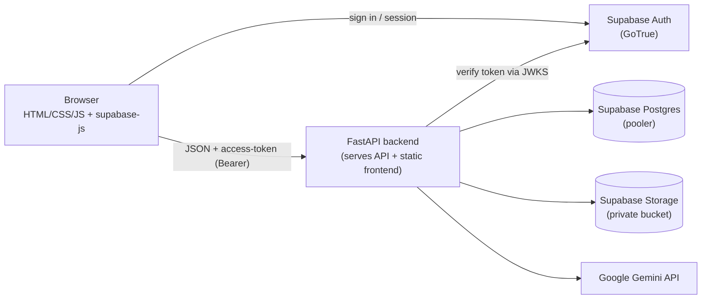

# SmartResumeAI

An AI-powered resume builder and ATS (Applicant Tracking System) analyzer. Build a
resume, preview it in four genuinely distinct templates, download it as a **real
text-based PDF** (not an image), and get both a deterministic ATS score **and**
AI-written feedback on how to improve it.

> Full-stack project: a vanilla HTML/CSS/JS frontend on top of a **FastAPI**
> backend, with authentication, database, and file storage all powered by
> **Supabase**, a deterministic **ATS scoring engine**, and **Google Gemini** for
> AI feedback. One container serves both the API and the frontend.

---

## ✨ Features

- **Accounts & auth** — register / login handled by **Supabase Auth (GoTrue)**. The
  browser talks to Supabase directly for sign-in; the backend only *verifies* the
  access token it receives.
- **Resume builder** — structured form saved to your account in Postgres (not the
  browser's localStorage).
- **Templates & preview** — render your resume in **4 distinct templates**
  (Professional, Modern, Corporate, Creative) and **download a real PDF** via the
  browser's native print engine — selectable, searchable, and **ATS-parseable text**
  (the old image-based export produced zero extractable characters).
- **ATS analyzer** — upload a PDF/DOCX/TXT *or* score your built resume across five
  weighted dimensions: keyword match vs. a job description, section coverage, action
  verbs, quantified impact, and readability — scored out of 100 with a letter grade.
- **AI feedback (Gemini)** — prioritized, human-like suggestions layered on top of
  the deterministic score. The AI never changes the number.
- **File storage** — uploaded resumes are persisted to a private **Supabase Storage**
  bucket, written server-side with the service-role key.
- **Dashboard** — real stats (resumes created, latest ATS score) pulled from your data.
- **Design system** — "Lazy" dark editorial theme (Fraunces serif for display, Inter
  for UI), achromatic and print-safe.
- Rate-limited AI endpoints, health/status probes, and auto-generated API docs at `/docs`.

---

## 🧱 Tech stack

| Layer | Technology |
|---|---|
| Frontend | HTML5, CSS3, vanilla JavaScript (fetch), `supabase-js` (GoTrue client), native print-to-PDF |
| Backend | Python 3.12, FastAPI, Uvicorn |
| Database | Supabase **Postgres** (transaction pooler) via SQLAlchemy 2.0 + **psycopg 3**; SQLite for local dev |
| Auth | Supabase Auth (GoTrue). Backend verifies JWTs via the project **JWKS** endpoint (asymmetric ES256/RS256) or a legacy HS256 secret — `python-jose` |
| Storage | Supabase Storage — private bucket for uploaded resume files |
| AI | Google Gemini (`google-genai`), model `gemini-flash-latest` |
| Rate limiting | `slowapi` on the AI endpoints |
| Parsing | `pypdf`, `python-docx` (resume file extraction) |
| Tests | `pytest` (30 tests) |
| Deploy | Docker (single container, AWS ECR base image), Coolify, GitHub |

---

## 🏗️ Architecture



**How auth flows:** the frontend authenticates against Supabase directly and receives
an access token. It sends that token as a `Bearer` header to the FastAPI API, which
verifies the signature against the project's JWKS endpoint (or an HS256 secret) —
the backend never sees or stores passwords. The **anon key** is public by design
(gated by Row Level Security); the **service-role key** and **Gemini key** never
leave the server. The frontend only ever calls the API — it never touches the
database or the AI key directly.

---

## 📁 Project structure

```
SmartResumeAI/
├── Dockerfile                  # single container: FastAPI serves the API + frontend
├── .dockerignore, .gitignore
├── frontend/
│   ├── index.html login.html signup.html dashboard.html
│   ├── buildresume.html templates.html preview.html ats.html profile.html
│   ├── css/        # style.css (shared "Lazy" system) + one file per page + preview.css
│   ├── js/
│   │   ├── config.js   # API base + Supabase client bootstrap (reads /api/config)
│   │   └── script.js   # all frontend logic (fetch + GoTrue session)
│   └── assets/     # icons + template preview SVGs
├── backend/
│   ├── app/
│   │   ├── main.py         # FastAPI entrypoint (API under /api + serves static frontend)
│   │   ├── core/           # config, supabase_auth (JWKS), storage, ratelimit
│   │   ├── db/             # SQLAlchemy models: profiles, resumes, ats_reports
│   │   ├── routers/        # auth, resumes, ats, config, health
│   │   ├── schemas/        # Pydantic request/response models
│   │   └── services/       # ats_engine, ai_service, file_parse
│   ├── tests/          # pytest suite (30 tests)
│   ├── requirements.txt
│   └── .env.example
├── supabase/
│   └── schema.sql      # tables + Row Level Security policies
└── ResumeAI_Production_Upgrade_Guide.md
```

---

## ⚙️ Configuration

All settings load from environment variables (or a local `backend/.env` in dev) via
`pydantic-settings`. Copy `backend/.env.example` to `backend/.env` to start. Nothing
sensitive is ever committed — in production these live in Coolify's Environment
Variables panel.

| Variable | Required | Purpose |
|---|---|---|
| `DATABASE_URL` | prod | Supabase **transaction pooler** URL, prefixed `postgresql+psycopg://` (port 6543). Defaults to SQLite locally. |
| `SUPABASE_URL` | ✅ | `https://<ref>.supabase.co` |
| `SUPABASE_ANON_KEY` | ✅ | Public key served to the browser (safe; gated by RLS). |
| `SUPABASE_SERVICE_ROLE_KEY` | ✅ | **Secret**, server-only — used for Storage writes. |
| `SUPABASE_JWT_SECRET` | optional | Legacy HS256 secret. Leave **blank** to verify via JWKS (new asymmetric keys). |
| `SUPABASE_STORAGE_BUCKET` | optional | Private bucket for uploads (default `resumes`). |
| `STORE_UPLOADS` | optional | Persist uploaded files to the bucket (default `true`). |
| `GEMINI_API_KEY` | optional | Enables AI feedback. Blank ⇒ AI reports "disabled". |
| `GEMINI_MODEL` | optional | Default `gemini-flash-latest`. |
| `ENV` | optional | `development` \| `production`. |
| `CORS_ORIGINS` | optional | Comma-separated; local dev only (same-origin needs none). |

### Supabase setup

1. Create a Supabase project.
2. In the **SQL Editor**, run [`supabase/schema.sql`](supabase/schema.sql) to create
   the `profiles`, `resumes`, and `ats_reports` tables and their RLS policies.
3. Grab from the dashboard:
   - **Project URL** and **anon** + **service-role** keys → *Settings → API*.
   - **Transaction pooler** connection string (port 6543) → the green **Connect** button.
4. Put them in `backend/.env` (or Coolify). Prefix the pooler URL with `postgresql+psycopg://`.

---

## 🚀 Getting started (local)

### Option A — Docker (matches production)

```bash
docker build -t smartresume .
docker run -p 8000:8000 --env-file backend/.env smartresume
```

Open **http://localhost:8000** — one container serves both the API and the frontend.

### Option B — split dev (hot reload)

**Backend** (Python 3.12), in one terminal:

```bash
cd backend
python -m venv .venv && source .venv/bin/activate   # Windows: .venv\Scripts\activate
pip install -r requirements.txt
cp .env.example .env          # then edit .env (see Configuration)
uvicorn app.main:app --reload # API on http://localhost:8000
```

**Frontend**, from the `frontend/` dir in a second terminal:

```bash
cd frontend
python -m http.server 5500
```

Open **http://localhost:5500/index.html**. `js/config.js` auto-detects port 5500/5501
and points the API base at `:8000`; those origins are pre-allowed by the backend's CORS.

> ⚠️ Serve the frontend through a local server, **not** by double-clicking the HTML
> file — a `file://` page is blocked by CORS and can't reach Supabase.

---

## 🤖 Enabling AI (free)

1. Get a free Gemini API key (no credit card): https://aistudio.google.com/apikey
2. Add it to `backend/.env`:
   ```
   GEMINI_API_KEY=your_key_here
   ```
3. Restart the backend. AI feedback now appears on the ATS page. Without a key the app
   runs fine — AI feedback simply shows as "off".

---

## ✅ Tests

```bash
cd backend
pytest -q      # 30 tests: health, auth, ATS engine + API, resume CRUD, models, per-user isolation
```

Tests default to SQLite and stub external services, so no Supabase/Gemini credentials
are needed to run them.

---

## ☁️ Deployment (GitHub + Coolify)

The repo ships a root **`Dockerfile`** (single container — FastAPI serves both the API
and the static frontend), so in Coolify pick the **Dockerfile** build pack with base
directory `/`.

1. Point Coolify at this GitHub repo, branch `main`.
2. Set the environment variables from the [Configuration](#️-configuration) table.
3. Coolify injects `$PORT`; the container honors it (`uvicorn ... --port ${PORT:-8000}`).
4. Health check: `GET /api/health`. Feature snapshot: `GET /api/status`. Public frontend
   config: `GET /api/config`.

Because the frontend and API share an origin in production, there is no CORS to
configure. The base image is pulled from **AWS's public ECR mirror** of the official
Python image to avoid Docker Hub's anonymous pull-rate limit on the build host.

---

## 📄 License

Built as a TY B.Sc. Computer Science major project. Free to use and adapt.
