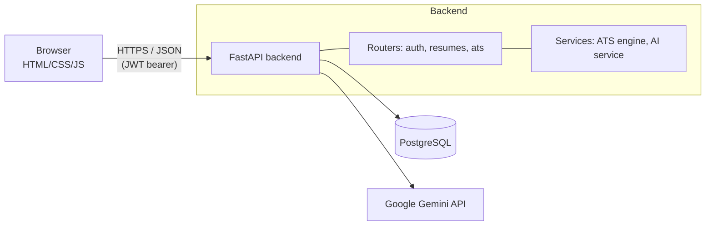

# ResumeAI

An AI-powered resume builder and ATS (Applicant Tracking System) analyzer. Build a
resume, preview it in polished templates, download it as a PDF, and get both a
deterministic ATS score **and** AI-written feedback on how to improve it.

> Full-stack project: a vanilla HTML/CSS/JS frontend connected to a **FastAPI**
> backend with **JWT auth**, **PostgreSQL**, a deterministic **ATS scoring engine**,
> and **Google Gemini** for AI feedback.

---

## ✨ Features

- **Accounts & auth** — register / login with JWT; passwords hashed with bcrypt.
- **Resume builder** — structured form saved to your account (not the browser).
- **Templates & preview** — render your resume in 4 templates and **download it as a PDF**.
- **ATS analyzer** — upload a PDF/DOCX/TXT *or* score your built resume:
  keyword match vs. a job description, section coverage, action verbs, quantified
  impact, readability — with a weighted score out of 100.
- **AI feedback (Gemini)** — prioritized, human-like suggestions on top of the score.
- **Dashboard** — real stats (resumes created, latest ATS score) from your data.
- Auto-generated interactive API docs at `/docs`.

---

## 🧱 Tech stack

| Layer | Technology |
|---|---|
| Frontend | HTML5, CSS3, vanilla JavaScript (fetch API), html2pdf.js |
| Backend | Python, FastAPI, Uvicorn |
| Database | PostgreSQL (prod) / SQLite (local dev) via SQLAlchemy 2.0 |
| Auth | JWT (PyJWT) + bcrypt |
| AI | Google Gemini API |
| Tests | pytest (15 API tests) |
| Deploy | Docker, Coolify, GitHub |

---

## 🏗️ Architecture



The frontend only ever calls the API — it never touches the database or the AI key
directly. Secrets live in the backend's environment, never in the browser.

---

## 📁 Project structure

```
ResumeAI/
├── index.html, login.html, signup.html, dashboard.html,
│   buildresume.html, templates.html, preview.html, ats.html, profile.html
├── css/            # styles (one file per page + shared style.css + preview.css)
├── js/
│   ├── config.js   # API base URL (edit this for production)
│   └── script.js   # all frontend logic (talks to the API)
├── assets/         # icons + template preview images
├── backend/        # FastAPI application (see backend/README.md)
│   ├── app/        # routers, services, models, schemas
│   ├── tests/      # pytest suite
│   ├── Dockerfile, docker-compose.yml, requirements.txt
│   └── DEPLOY_COOLIFY.md
└── ResumeAI_Production_Upgrade_Guide.md
```

---

## 🚀 Getting started (local)

You need **two** things running: the backend API and the frontend.

**1. Backend** (Python 3.10+):

```bash
cd backend
python -m venv .venv
# Windows: .venv\Scripts\activate   |   macOS/Linux: source .venv/bin/activate
pip install -r requirements.txt
copy .env.example .env      # then edit .env (see below)
uvicorn app.main:app --reload
```

**2. Frontend** (from the project root, in a second terminal):

```bash
python -m http.server 5500
```

Open **http://localhost:5500/index.html**. (VS Code **Live Server** also works — it
uses port 5500, which is pre-allowed by the backend's CORS settings.)

> ⚠️ Open the frontend through a local server, **not** by double-clicking the HTML
> file — a `file://` page is blocked by CORS.

---

## 🤖 Enabling AI (free)

1. Get a free Gemini API key (no credit card): https://aistudio.google.com/apikey
2. Add it to `backend/.env`:
   ```
   GEMINI_API_KEY=your_key_here
   ```
3. Restart the backend. AI feedback now appears on the ATS page. Without a key the
   app runs fine — AI feedback simply shows as "off".

---

## ✅ Tests

```bash
cd backend
pytest -q      # 15 tests: auth, ATS engine, resume CRUD, per-user isolation
```

---

## ☁️ Deployment (GitHub + Coolify)

The backend ships with a `Dockerfile`, so Coolify builds it directly. Full
step-by-step instructions — Postgres, environment variables, ports, domain, SSL —
are in **[`backend/DEPLOY_COOLIFY.md`](backend/DEPLOY_COOLIFY.md)**.

For production, set your deployed backend URL in `js/config.js` (`PRODUCTION_API_URL`)
and add your frontend's domain to the backend's `CORS_ORIGINS`.

---

## 📄 License

Built as a TY B.Sc. Computer Science major project. Free to use and adapt.
